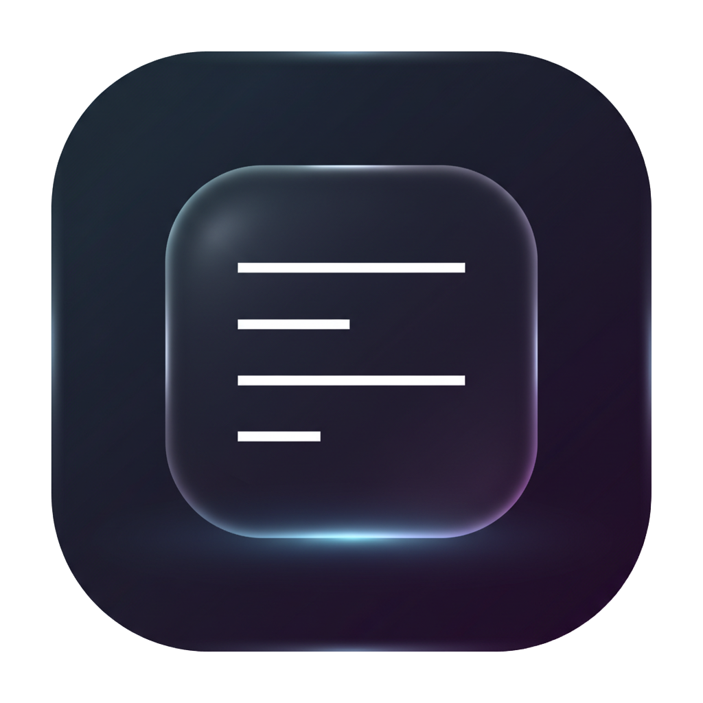
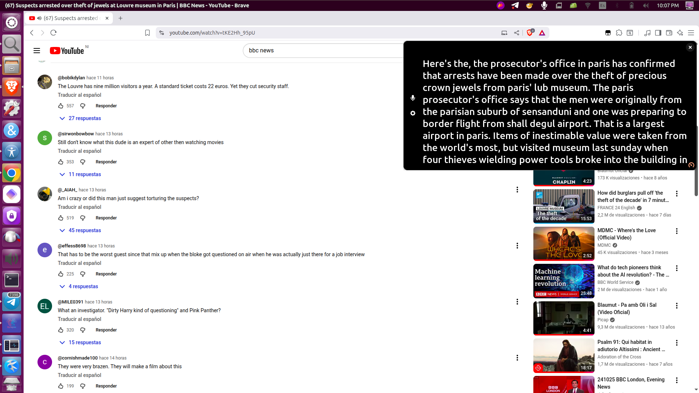

# Live Captions Enhanced



This document is also available in [Español](#español).

---

## The Definitive Captioning Solution for Linux

Live Captions Enhanced is not just another transcription tool. It is the most advanced, optimized, and private real-time captioning application ever built for the Linux desktop. 

Through an intensive reimplementation process led by Walter García, this project has evolved from its original foundation into a state-of-the-art neural accessibility tool. By combining the power of ONNX Runtime with a custom-engineered GTK4/Libadwaita interface, Live Captions Enhanced delivers unprecedented performance and a professional-grade user experience that sits at the top of its class.

Everything happens on your device. No cloud. No latency. Absolute privacy.

## Features

*   Premium Neural Engine: Real-time, high-accuracy transcription powered by local AI.
*   Total Privacy and Offline Security: Zero data leaves your machine. No internet connection or cloud APIs required.
*   Master-Class User Experience: A professional, modern interface utilizing Libadwaita for seamless desktop integration.
*   Advanced UI Customization: Precise control over typography, window transparency (glassmorphism), and dynamic width.
*   Intelligent History Management: Integrated session tracking with optimized export and clipboard functionality.
*   Content Integrity: Built-in profanity and slur filtering for professional environments.
*   High Efficiency Design: Optimized C codebase delivering low CPU utilization and ultra-fast response times.



## Build and Installation (From Source)

Ensure you have the required dependencies before proceeding.

### 1. Install Dependencies

```bash
sudo apt install meson ninja-build pkg-config build-essential libadwaita-1-dev libpulse-dev appstream-util desktop-file-utils gettext
```

### 2. Install ONNX Runtime

The core of the speech recognition engine requires this specific library.

```bash
# Download version 1.14.1
wget https://github.com/microsoft/onnxruntime/releases/download/v1.14.1/onnxruntime-linux-x64-1.14.1.tgz

# Extract and move to /opt
tar -zxvf onnxruntime-linux-x64-1.14.1.tgz
sudo mv onnxruntime-linux-x64-1.14.1 /opt/

# Clean up the downloaded archive
rm onnxruntime-linux-x64-1.14.1.tgz
```

### 3. Configure Environment Variables

Add these lines to your ~/.bashrc or ~/.zshrc for a permanent configuration.

```bash
export ONNX_ROOT=/opt/onnxruntime-linux-x64-1.14.1/
export LD_LIBRARY_PATH=$ONNX_ROOT/lib:$LD_LIBRARY_PATH
```

Apply the changes:
```bash
source ~/.bashrc
```

### 4. Build the Project

```bash
meson setup build
ninja -C build
sudo ninja -C build install
```

## Credits and Authorship

*   Lead Developer and Architect: Walter García. Walter has invested extensive research and development time into optimizing the engine, redesigning the UI architecture, and implementing professional features that elevate this project beyond its original scope.
*   Original Foundation and Inspiration: [abb128](https://github.com/abb128/LiveCaptions). We acknowledge and honor the foundational work of the original author, whose initial vision sparked the creation of this enhanced edition.

## License

This project is licensed under the GPL-3.0-or-later.

---

<a name="español"></a>
## Español

## La Solución Definitiva de Subtitulado para Linux

Live Captions Enhanced no es simplemente una herramienta de transcripción más. Es la aplicación de subtitulado en tiempo real más avanzada, optimizada y privada jamás construida para el escritorio Linux.

A través de un proceso intensivo de reimplementación liderado por Walter García, este proyecto ha evolucionado desde su base original hasta convertirse en una herramienta de accesibilidad neural de vanguardia. Al combinar el poder de ONNX Runtime con una interfaz GTK4/Libadwaita diseñada a medida, Live Captions Enhanced ofrece un rendimiento sin precedentes y una experiencia de usuario profesional que se sitúa en la cima de su categoría.

Todo ocurre en tu dispositivo. Sin nube. Sin latencia. Privacidad absoluta.

## Características

*   Motor Neural Premium: Transcripción de alta precisión en tiempo real impulsada por IA local.
*   Privacidad Total y Seguridad Offline: Ningún dato sale de tu máquina. No requiere conexión a internet ni APIs en la nube.
*   Experiencia de Usuario de Clase Maestra: Una interfaz profesional y moderna que utiliza Libadwaita para una integración perfecta con el escritorio.
*   Personalización Avanzada de UI: Control preciso sobre la tipografía, transparencia de ventana (glassmorphism) y ancho dinámico.
*   Gestión Inteligente de Historial: Seguimiento de sesiones integrado con funcionalidades optimizadas de exportación y copiado al portapapeles.
*   Integridad de Contenido: Filtrado integrado de lenguaje inapropiado para entornos profesionales.
*   Diseño de Alta Eficiencia: Código base en C optimizado para un bajo consumo de CPU y tiempos de respuesta ultrarrápidos.

## Compilación e Instalación (Desde el código fuente)

### 1. Instalar Dependencias

```bash
sudo apt install meson ninja-build pkg-config build-essential libadwaita-1-dev libpulse-dev appstream-util desktop-file-utils gettext
```

### 2. Instalar ONNX Runtime

```bash
wget https://github.com/microsoft/onnxruntime/releases/download/v1.14.1/onnxruntime-linux-x64-1.14.1.tgz
tar -zxvf onnxruntime-linux-x64-1.14.1.tgz
sudo mv onnxruntime-linux-x64-1.14.1 /opt/
rm onnxruntime-linux-x64-1.14.1.tgz
```

### 3. Configurar Variables de Entorno

Añade estas líneas a tu ~/.bashrc o ~/.zshrc:

```bash
export ONNX_ROOT=/opt/onnxruntime-linux-x64-1.14.1/
export LD_LIBRARY_PATH=$ONNX_ROOT/lib:$LD_LIBRARY_PATH
```

### 4. Compilar el Proyecto

```bash
meson setup build
ninja -C build
sudo ninja -C build install
```

## Créditos y Autoría

*   Desarrollador Principal y Arquitecto: Walter García. Walter ha invertido un tiempo extensivo en investigación y desarrollo para optimizar el motor, rediseñar la arquitectura de la interfaz e implementar características profesionales que elevan este proyecto más allá de su alcance original.
*   Base Original e Inspiración: [abb128](https://github.com/abb128/LiveCaptions). Reconocemos y honramos el trabajo fundacional del autor original, cuya visión inicial impulsó la creación de esta edición mejorada.

## Licencia

Este proyecto está licenciado bajo la GPL-3.0-or-later.
