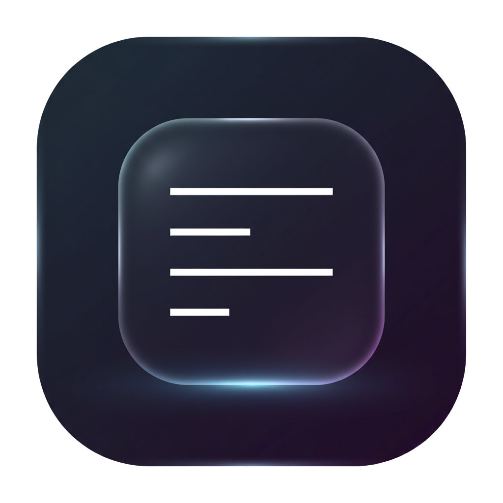
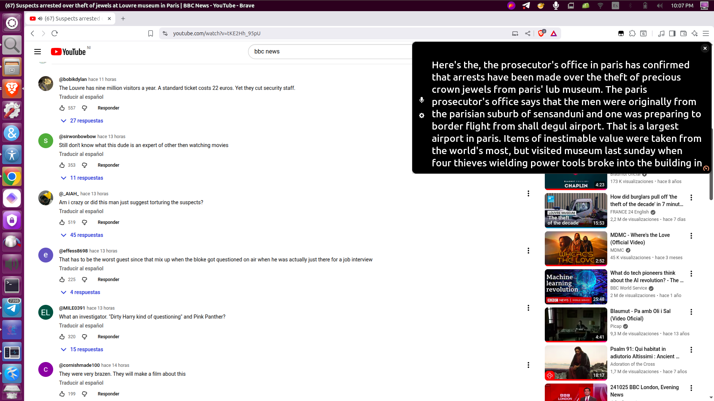

# Live Captions Enhanced



This document is also available in [Español](#-español).

---

## Description

**Live Captions Enhanced** represents a significant reimplementation and optimization of the original Live Captions project. Maintained by Walter García, this initiative delivers what is, to date, the most robust, private, and performant on-device captioning solution available for the Linux desktop.

The application leverages a sophisticated local speech-to-text engine to provide real-time transcriptions of desktop or microphone audio. All processing is executed entirely on-device, ensuring absolute data privacy and eliminating any dependency on cloud services or external APIs.

This fork honors the foundational work of the [original author (abb128)](https://github.com/abb128/LiveCaptions), whose initial vision and effort served as the fundamental inspiration for this definitive version.

## Features

*   **Real-Time Transcription:** Instantly transcribes desktop or microphone audio.
*   **On-Device Processing:** Operates completely offline. No data is ever sent to the cloud, guaranteeing 100% privacy.
*   **API-Key-Free:** Requires no third-party service configuration or API keys.
*   **Customizable UI:** Allows adjustments for font, size, window width, and transparency.
*   **Content Filtering:** Provides options to filter inappropriate language.
*   **Session History:** Saves, displays, and allows exporting transcripts.
*   **Minimalist Interface:** Designed to be simple and non-intrusive.



## Build and Installation (From Source)

Ensure you have the required dependencies before proceeding.

### 1. Install Dependencies

```bash
sudo apt install meson ninja-build pkg-config build-essential libadwaita-1-dev libpulse-dev appstream-util desktop-file-utils gettext
```

### 2. Install ONNX Runtime

This library is critical for the speech recognition engine.

```bash
# Download version 1.14.1
wget https://github.com/microsoft/onnxruntime/releases/download/v1.14.1/onnxruntime-linux-x64-1.14.1.tgz

# Extract and move to /opt
tar -zxvf onnxruntime-linux-x64-1.14.1.tgz
sudo mv onnxruntime-linux-x64-1.14.1 /opt/

# Clean up the downloaded archive
rm onnxruntime-linux-x64-1.14.1.tgz
```

### 3. Configure Environment Variables

For the changes to be permanent, add these lines to your `~/.bashrc` or `~/.zshrc` file.

```bash
export ONNX_ROOT=/opt/onnxruntime-linux-x64-1.14.1/
export LD_LIBRARY_PATH=$ONNX_ROOT/lib:$LD_LIBRARY_PATH
```

Remember to run `source ~/.bashrc` or restart your terminal to apply the changes.

### 4. Build the Project

```bash
# Set up the build environment with Meson
meson setup build

# Compile with Ninja
ninja -C build

# Install the application system-wide
sudo ninja -C build install
```

Once installed, "Live Captions" will be available in your application menu.

## Credits

*   **Author of this Reimplementation:** Walter García
*   **Inspiration and Original Codebase:** [abb128](https://github.com/abb128/LiveCaptions)

## License

This project is licensed under the **GPL-3.0-or-later**.


---


## 🇪🇸 Español

## Descripción

**Live Captions Enhanced** representa una reimplementación y optimización significativa del proyecto original Live Captions. Mantenido por Walter García, esta iniciativa ofrece la que es, hasta la fecha, la solución de subtitulado local más robusta, privada y de mayor rendimiento disponible para el escritorio Linux.

La aplicación utiliza un sofisticado motor local de conversión de voz a texto para proporcionar transcripciones en tiempo real del audio del escritorio o del micrófono. Todo el procesamiento se ejecuta íntegramente en el dispositivo, garantizando una privacidad absoluta de los datos y eliminando cualquier dependencia de servicios en la nube o API externas.

Este fork rinde homenaje al trabajo fundamental del [autor original (abb128)](https://github.com/abb128/LiveCaptions), cuya visión y esfuerzo inicial sirvieron como inspiración fundamental para esta versión definitiva.

## Características

*   **Transcripción en Tiempo Real:** Subtitula instantáneamente el audio del escritorio o del micrófono.
*   **Procesamiento Local:** Funciona completamente offline. Ningún dato se envía a la nube, garantizando 100% de privacidad.
*   **Sin Claves de API:** No requiere configuración de servicios de terceros ni claves de API.
*   **Interfaz Personalizable:** Permite ajustar la fuente, el tamaño, el ancho de la ventana y la transparencia.
*   **Filtrado de Contenido:** Opciones para filtrar lenguaje inapropiado.
*   **Historial de Sesiones:** Guarda, muestra y permite exportar las transcripciones.
*   **Interfaz Minimalista:** Diseñada para ser simple y no intrusiva.

## Compilación e Instalación (Desde el código fuente)

Asegúrate de tener instaladas las dependencias requeridas antes de continuar.

### 1. Instalar Dependencias

```bash
sudo apt install meson ninja-build pkg-config build-essential libadwaita-1-dev libpulse-dev appstream-util desktop-file-utils gettext
```

### 2. Instalar ONNX Runtime

Esta librería es crucial para el motor de reconocimiento de voz.

```bash
# Descargar la versión 1.14.1
wget https://github.com/microsoft/onnxruntime/releases/download/v1.14.1/onnxruntime-linux-x64-1.14.1.tgz

# Descomprimir y mover a /opt
tar -zxvf onnxruntime-linux-x64-1.14.1.tgz
sudo mv onnxruntime-linux-x64-1.14.1 /opt/

# Limpiar el archivo descargado
rm onnxruntime-linux-x64-1.14.1.tgz
```

### 3. Configurar Variables de Entorno

Para que los cambios sean permanentes, añade estas líneas a tu archivo `~/.bashrc` o `~/.zshrc`.

```bash
export ONNX_ROOT=/opt/onnxruntime-linux-x64-1.14.1/
export LD_LIBRARY_PATH=$ONNX_ROOT/lib:$LD_LIBRARY_PATH
```

Recuerda ejecutar `source ~/.bashrc` o reiniciar tu terminal para aplicar los cambios.

### 4. Compilar el Proyecto

```bash
# Configurar el entorno de compilación con Meson
meson setup build

# Compilar con Ninja
ninja -C build

# Instalar la aplicación en el sistema
sudo ninja -C build install
```

Una vez instalado, encontrarás "Live Captions" en tu menú de aplicaciones.

## Créditos

*   **Autor de esta reimplementación:** Walter García
*   **Inspiración y base de código original:** [abb128](https://github.com/abb128/LiveCaptions)

## Licencia

Este proyecto está licenciado bajo la **GPL-3.0-or-later**.
